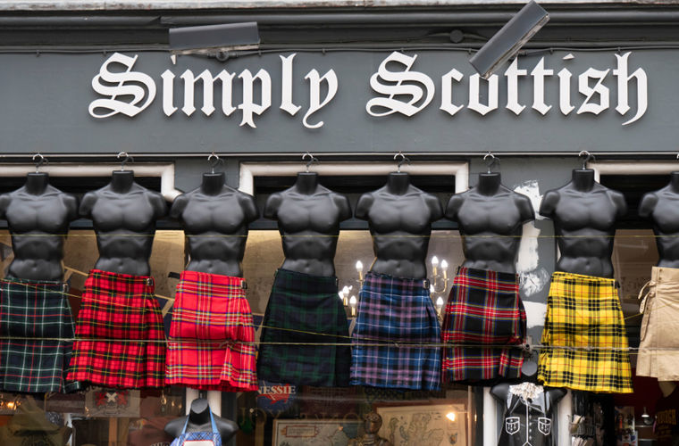

**ПОЧЕМУ В ШОТЛАНДИИ МУЖЧИНЫ НОСЯТ ЮБКИ?**

Говорить, что мужская одежда — это брюки, нельзя. Вспомним историю. Древние греки носили хитоны, то есть, по сути, задрапированные платья, а римляне надевали доспехи поверх коротких туник и считали штаны варварской неприличной одеждой. При этом ни у кого и мысли не возникает усомниться в их мужественности!

Да и в наши дни мужчины носят юбки не только в Шотландии. Так, в странах Юго-Восточной Азии: Индонезии, Камбодже, Бангладеш, Малайзии, на Шри-Ланке — мужской поясной одеждой является саронг, драпированная юбка. Такую же одежду носят мужчины Полинезии. Важная часть японского самурайского костюма — драпированные хакама, фактически юбка-брюки. Один из вариантов китайского мужского костюма — длинное платье с запахом, подпоясанное широким поясом. В жарких арабских странах мужчины носят длинные белые или цветные рубашки до пят, которые в разных регионах называют по-разному: галабея, тауб, дешдаша. Также они распространены в Северной и Центральной Африке.

Почему европейцы предпочитают брюки, неизвестно. Возможно, им просто холодно. Нет однозначного ответа и на вопрос, почему шотландцы носят килт. Все потому, что эта традиция берет начало из глубины веков. Однако основная версия все же существует — удобство. Сначала килт носили не все шотландцы, а лишь горцы. Он представлял собой большой некроеный кусок шерстяной клетчатой ткани, который выступал и юбкой, и верхней частью одежды. Это был так называемый большой килт. Такая одежда идеально подходила для дождливого климата и гористой местности, так как хорошо согревала, отлично высыхала, обеспечивала свободу передвижения днем и становилась теплым пледом ночью. Позже, примерно в XVIII веке, когда исчезла необходимость обматываться от непогоды, появился малый килт, то есть тот, который мы знаем сейчас.

Однако утверждать, что всему причиной стал климат, нельзя. Достаточно вспомнить древних греков и римлян, которые жили полностью в других условиях.

Зато известна история орнамента шотландского килта. При изготовлении этой одежды традиционно использовалась специальная ткань — тартан, сотканная из натуральной шерсти. В переводе с кельтского ее название означает «крест-накрест» или же «цвет местности». По цвету и рисунку тартана можно было определить, к какому клану относится шотландец и откуда именно он родом. Есть версия, что рисунки тартана произошли от племенных татуировок.

В 1745 году, когда англичане подавили восстание якобитов, которые стремились посадить на трон представителей династии Стюартов, килт запретили. За счет этого, когда к концу XVIII века запрет сняли, многие рисунки оказались забыты. Часть из них восстановили по картинам и старинным книгам, а со временем появилось много новых вариантов клетки. Сейчас их насчитывается более 6000.
