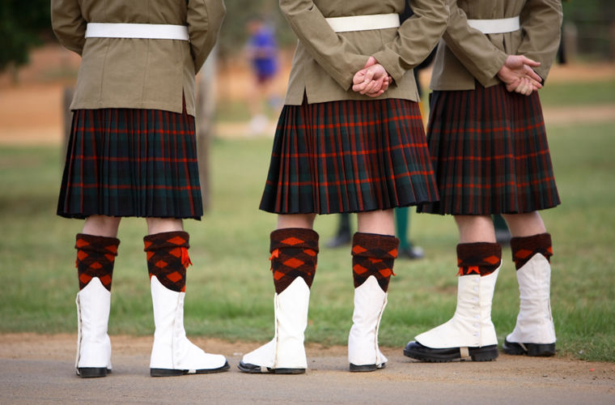

** WHY DO MEN WEAR SKIRTS IN SCOTLAND?

You cannot say that men's clothes are pants. Remember the story. The ancient Greeks wore chitons, that is, in fact, draped dresses, and the Romans wore armor over short tunics and considered the pants barbaric indecent clothing. At the same time, no one has an idea to doubt their masculinity!

And nowadays men wear skirts not only in Scotland. Thus, in Southeast Asia: Indonesia, Cambodia, Bangladesh, Malaysia, Sri Lanka - men's belt clothing is sarong, draped skirt. Men of Polynesia wear the same clothes. An important part of the Japanese samurai costume - draped hakama, in fact, the skirt-pants. One of the variants of the Chinese men's suit is a long dress with a smell, waisted with a wide belt. In hot Arab countries, men wear long white or colored shirts up to their heels, which are called differently in different regions: galabeya, taub, dashash. They are also common in North and Central Africa.

It is not known why Europeans prefer pants. Maybe they are just cold. There is no unambiguous answer to the question why the Scots wear kilt. It is because this tradition originates from the depths of the centuries. However, the main version still exists - convenience. At first, the kilt was worn not by all Scots, but only by the Highlanders. It was a large necrown piece of woolen plaid fabric, which served as a skirt, and the upper part of clothing. It was a so-called big kilt. Such clothes were ideal for rainy climate and mountainous terrain, because they were well warmed, perfectly dried out, provided freedom of movement during the day and became a warm blanket at night. Later, around the XVIII century, when there was no need to be wrapped in weather, there was a small kilt, that is, the one we know now.

However, it is impossible to claim that the whole reason was the climate. It is enough to remember the ancient Greeks and Romans, who lived completely in different conditions.

But the history of the Scottish kilt ornament is known. Traditionally, a special fabric - tartan, woven from natural wool - was used in the manufacture of these clothes. In translation from Celtic its name means "crosswise" or "color of the area. Based on the color and pattern of the tartan, it was possible to determine which clan a Scotsman belongs to and where exactly he comes from. There is a version that the drawings of the tartan came from tribal tattoos.

In 1745, when the British suppressed the uprising Jacobite, who sought to put on the throne representatives of the Stuart dynasty, Kilt banned. Due to this, when by the end of XVIII century the ban was lifted, many drawings were forgotten. Some of them were restored from paintings and old books, and over time there were many new variants of the cell. Now there are more than 6000 of them.

